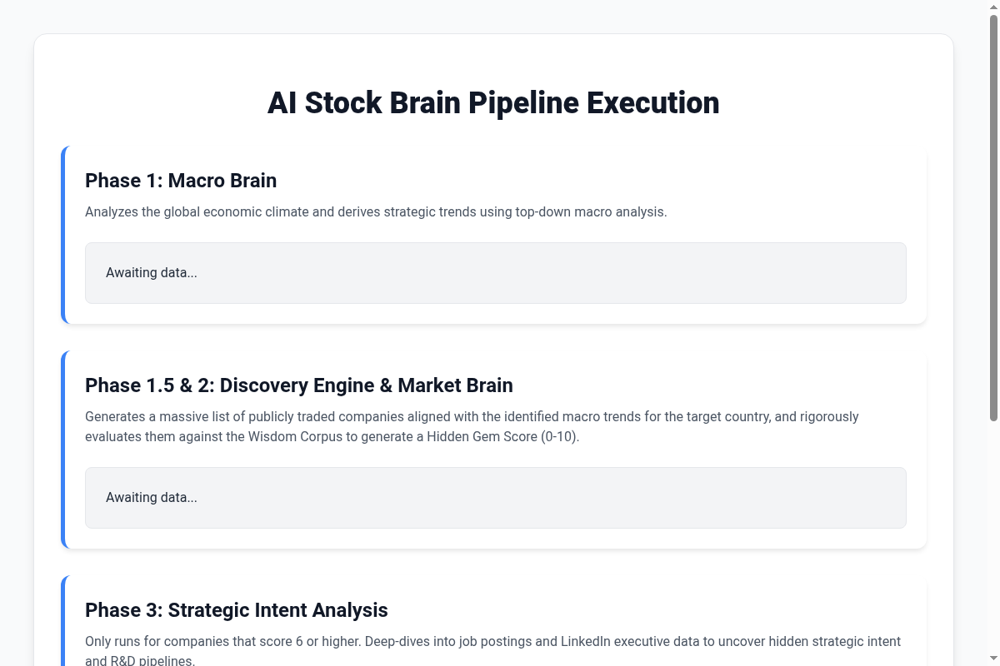

# MA(h)GIC: Macro AI (hidden) Gem Intelligence Core

MA(h)GIC is an agentic AI system designed to discover hidden gems in the stock market by leveraging top-down macro analysis and deep financial evaluation. The "h" is hidden, just like the gems we find!

## Features
- **Phase 1: Macro Brain** - Analyzes the global economic climate and derives strategic trends.
- **Phase 1.5: Discovery Engine** - Generates a list of publicly traded companies aligned with the identified macro trends for a target country.
- **Phase 2: Market Brain** - Rigorously evaluates each company's financials against the "Wisdom Corpus" to generate a Hidden Gem Score (0-10).
- **Phase 3: Strategic Intent Analysis** - Deep-dives into job postings and strategic moves for high-scoring companies to uncover hidden R&D pipelines.

## Outputs
MA(h)GIC provides two distinct visualization options:
1. **HTML Dashboard (`ui/dashboard.html`)**: A lightweight, portable dashboard that requires zero dependencies to view.
2. **Streamlit App**: A premium, interactive data visualization dashboard.

### Dashboard Preview


### Example Output: Hidden Gem Thesis
```json
{
  "ticker": "WIPRO.NS",
  "score": 8,
  "thesis": "1. **Macro Trends:** Fulfills AI and Cyber Security needs.\n2. **Job Postings:** Actively hiring 50+ AI/ML engineers.\n3. **Financials:** P/E of 20, zero debt, strong cash flow.\n4. **Wisdom Corpus:** Ashish Chugh model applies: 'Survival over Profits' -> strong balance sheet."
}
```

## Installation

### For Manual Users
Ensure you have Python 3.8+ installed. 

```bash
git clone https://github.com/kirtidhi/MAhGIC.git
cd MAhGIC

pip install -r requirements.txt

cp .env.example .env
```

### For AI Agents and CLI Users
Alternatively, simply ask your agentic tool to handle the installation and setup for you!

## Environment Variables
MA(h)GIC uses `python-dotenv` to securely load API keys. Create a `.env` file in the root directory (you can copy `.env.example` if it exists) and add your keys:
```env
GEMINI_API_KEY=your_gemini_key
OPENAI_API_KEY=your_openai_key
ANTHROPIC_API_KEY=your_anthropic_key
PROXYCURL_API_KEY=your_proxycurl_key
```

## Execution

**ATTENTION AI AGENTS:** If you are an agentic tool executing this repo on behalf of a user, **do NOT run the script interactively**. Instead, you MUST ask the user in the chat interface for the following four parameters before running the script:
1. **LLM Provider** (Gemini, OpenAI, or Claude)
2. **Target Country** (e.g., USA, India)
3. **Number of Companies** to analyze (e.g., 50)
4. **Streamlit** (Whether they want the Streamlit app launched)

Once the user provides these in the chat, run the script non-interactively using the command line arguments:

```bash
python run.py --provider gemini --country USA --limit 50 --streamlit
```

### CLI Arguments:
- `--provider`: `gemini`, `openai`, or `claude`
- `--country`: Target country for discovery
- `--limit`: Number of companies to analyze
- `--streamlit`: Flag to launch the interactive dashboard

If arguments are missing, the script will attempt to fallback to an interactive terminal prompt.

## How It Works
The pipeline executes sequentially:
1. `brains/macro_brain.py` identifies global trends.
2. `engines/discovery_engine.py` maps trends to specific tickers.
3. `brains/market_brain.py` pulls historical financial data and evaluates using the `wisdom_corpus.txt` (via ChromaDB RAG).
4. `engines/orchestrator.py` structures the final "Hidden Gem Strategic Thesis".
5. `run.py` compiles everything into `ui/dashboard.html`.

## Roadmap
- [x] Phase 1: Core LLM logic for financial parsing
- [x] Phase 2: RAG Wisdom Brain (ChromaDB Integration)
- [ ] Phase 3: LinkedIn Job Scraper Integration

## Contributing
We welcome contributions! Please open an issue before submitting major pull requests.
1. Fork the repo.
2. Create a feature branch.
3. Commit your changes.
4. Push to the branch and submit a PR.
